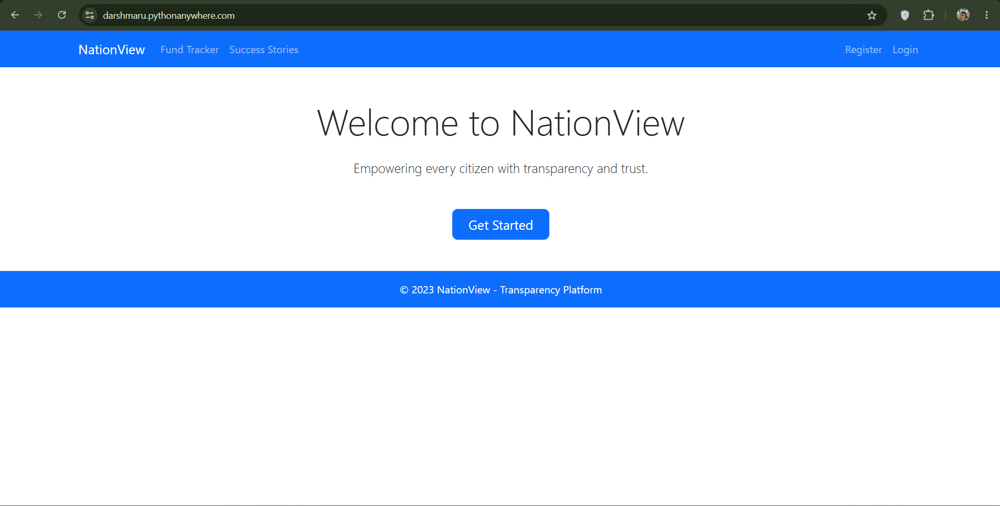
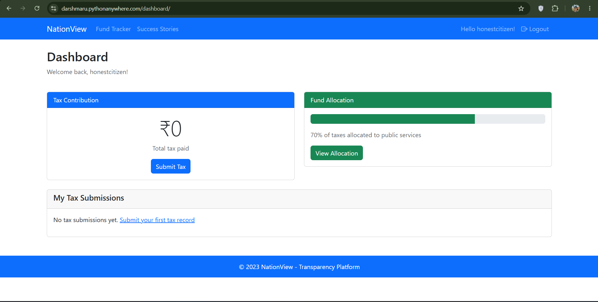
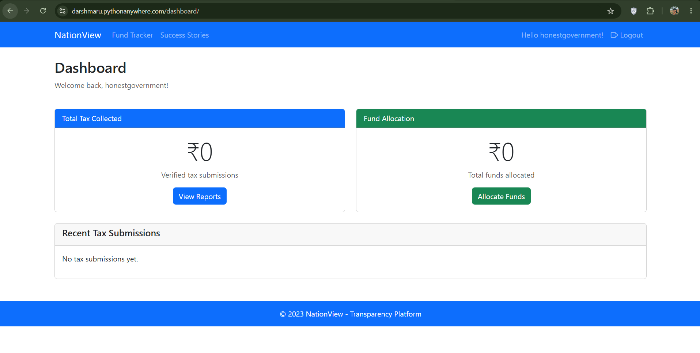
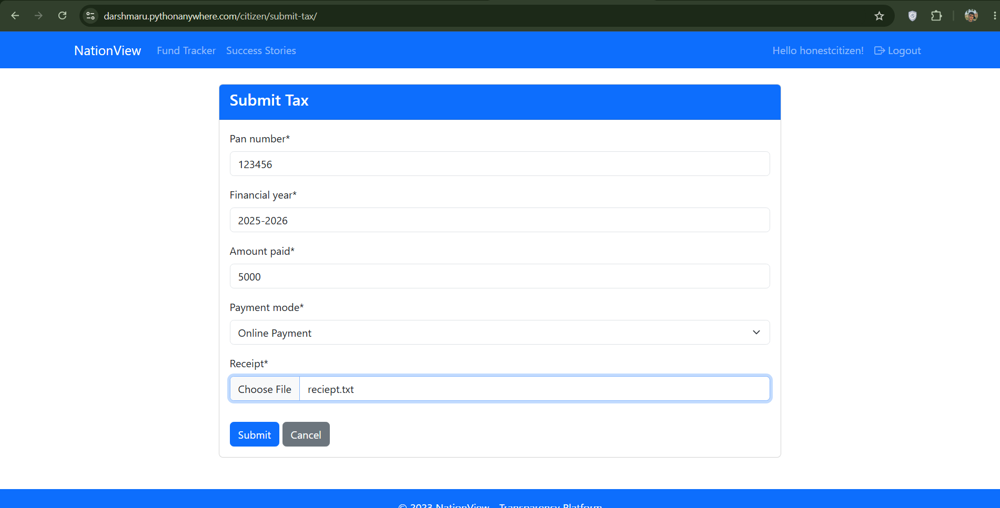

# NationView 🇮🇳

A full-stack Django-based e-Governance platform that enables citizens to pay taxes online and allows government authorities to manage and allocate collected funds efficiently.

## 🌐 Live Demo

https://darshmaru.pythonanywhere.com

## 📌 Overview

NationView is a digital governance platform designed to streamline tax collection and fund allocation processes. The system provides separate portals for citizens and government officials with role-based authentication and dashboards.

## ✨ Features

### Citizen Portal

* User Registration & Login
* Secure Authentication
* Online Tax Payment
* View Payment History
* Profile Management

### Government Portal

* Government Officer Login
* Fund Allocation Management
* Tax Collection Monitoring
* Dashboard Analytics

### Admin Features

* User Management
* Tax Record Management
* Government Data Administration
* Role-Based Access Control

## 🛠 Tech Stack

### Backend

* Django 4.2
* Python
* SQLite

### Frontend

* HTML
* CSS
* Bootstrap 5
* JavaScript

### Libraries

* Django Crispy Forms
* Crispy Bootstrap 5
* Pandas
* Matplotlib
* WhiteNoise

### Deployment

* PythonAnywhere

## 📷 Screenshots

### Home Page



### Citizen Dashboard



### Government Dashboard



### Tax Payment Dashboard



## 🚀 Installation

```bash
git clone https://github.com/darshmaru08/nation-view
cd nation-view

python -m venv venv
source venv/bin/activate

pip install -r requirements.txt

python manage.py migrate
python manage.py runserver
```

## 🔐 Admin Access

```bash
python manage.py createsuperuser
```

Then visit:

http://127.0.0.1:8000/admin/

## 📈 Future Enhancements

* Online Payment Gateway Integration
* Email Notifications
* Data Visualization Dashboard
* PostgreSQL Database
* REST API Integration
* Mobile Application

## 👨‍💻 Author

Darsh Maru

GitHub: https://github.com/darshmaru08
